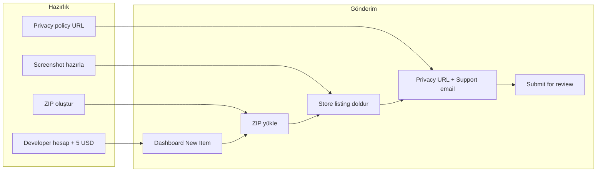

# Chrome Web Store’a Eklenti Yükleme Planı

Bu dosya, X Unfollow Radar eklentisini Chrome Web Store’a yüklemek için kullanılacak adım adım plandır. Daha sonra başvurulmak üzere projede saklanmaktadır.

---

## Mevcut durum

Projede zaten hazır olanlar:

- **Manifest V3** ([manifest.json](../manifest.json)): `name`, `version`, `description` (132 karakter altı), `icons` (16/48/128) tanımlı.
- **Store metinleri**: [STORE_LISTING.md](../STORE_LISTING.md) içinde kısa açıklama, özellikler, güvenlik, TR/EN açıklamalar ve ekran görüntüsü önerileri var.
- **Gizlilik metni**: [PRIVACY_POLICY.md](../PRIVACY_POLICY.md) mevcut; başlık hâlâ "Twitter/X Auto Unfollow" (X Unfollow Radar ile uyumlu değil) ve iletişim alanları placeholder (`[Your email here]`, `[Your GitHub repository]`).

Eksik veya yapılacaklar:

- Chrome Developer hesabı (tek seferlik ücret).
- Gizlilik politikasının **herkese açık bir URL** ile yayında olması (store zorunlu).
- En az 1 ekran görüntüsü (1280x800 veya 640x400 px); STORE_LISTING’de tarif var, dosya yok.
- Destek e‑postası ve (isteğe bağlı) web sitesi / GitHub linki.
- Yükleme için ZIP’in doğru içerikle oluşturulması.

---

## 1. Chrome Developer hesabı

- [Chrome Web Store Developer Dashboard](https://chrome.google.com/webstore/devconsole) üzerinden **Developer account** oluştur.
- **Tek seferlik $5** ödeme (Google hesabı ile giriş + ödeme bilgisi).
- Publisher name ve e‑posta doğrulaması tamamlanmalı.

---

## 2. Gizlilik politikası (URL zorunlu)

Chrome Web Store, **Privacy Policy** alanına mutlaka geçerli bir URL istiyor. Seçenekler:

| Seçenek          | Açıklama                                                                                                                                     |
| ---------------- | -------------------------------------------------------------------------------------------------------------------------------------------- |
| **GitHub**       | Repo’da `PRIVACY_POLICY.md` tut; URL olarak `https://github.com/berkayismus/x-unfollow-radar/blob/main/PRIVACY_POLICY.md` kullan (veya raw). |
| **GitHub Pages** | Repo’da Pages açıp tek sayfa olarak `PRIVACY_POLICY.md` içeriğini HTML’e koy; örn. `https://berkayismus.github.io/x-unfollow-radar/privacy`. |

Yapılacaklar:

- [PRIVACY_POLICY.md](../PRIVACY_POLICY.md) başlığını **"X Unfollow Radar"** ile uyumlu yap (şu an "Twitter/X Auto Unfollow Extension").
- İletişim bölümündeki `[Your email here]` ve `[Your GitHub repository]` placeholder’larını gerçek e‑posta ve repo linki ile değiştir.
- Bu dosyayı commit’leyip push’la; kullanacağın URL’i (GitHub veya GitHub Pages) not et.

---

## 3. Store listing içeriği ve görseller

**Metin:** [STORE_LISTING.md](../STORE_LISTING.md) zaten kısa açıklama (tagline), detaylı açıklama (TR/EN) ve kategori önerisini içeriyor. Dashboard’a yapıştırman yeterli.

**Ekran görüntüsü (zorunlu):** En az **1** adet; önerilen boyut **1280x800** veya **640x400** px.

- STORE_LISTING’de tarif edilenler: (1) Ana popup arayüzü, (2) Test modu onay ekranı, (3) Twitter Following sayfasında çalışırken, (4) İstatistik görünümü.
- Bunları extension’ı yükleyip çalıştırarak alıp, isimlendirip (örn. `screenshot1-popup.png`) bir klasörde topla.

**İsteğe bağlı:** Küçük tile (440x280), büyük tile (920x680), marquee (1400x560). İlk yayında zorunlu değil.

---

## 4. Yayın paketi (ZIP)

- **Kök dizinde** `manifest.json` olmalı (şu an öyle).
- ZIP’e **dahil edilecekler:** `manifest.json`, `src/`, `assets/`, `locales/`, `vendor/`, gerekirse `PRIVACY_POLICY.md` (store’da asıl kullanılacak olan URL’dir; ZIP’te bulunması zorunlu değil ama faydalı olabilir).
- **Hariç tutulacaklar:** `.git/`, `*.DS_Store`, geliştirme/dokümantasyon dosyaları (örn. `README.md`, `STORE_LISTING.md`) — bunlar eklentinin çalışması için gerekli değil ve paketi sadeleştirir.

Örnek komut (proje kökünde):

```bash
zip -r x-unfollow-radar.zip . -x "*.git*" "*/.DS_Store" "README.md" "STORE_LISTING.md"
```

ZIP’i açıp `manifest.json`’ın kökte olduğunu ve tüm gerekli dosyaların (icons, content script, popup, locales, vendor) içerde olduğunu kontrol et.

---

## 5. Developer Dashboard’da gönderim

1. [Chrome Web Store Developer Dashboard](https://chrome.google.com/webstore/devconsole) → **New Item**.
2. **ZIP dosyasını yükle**; hata varsa (manifest, icon vb.) düzeltip tekrar yükle.
3. **Store listing** sekmesi:
   - Short description: STORE_LISTING’deki tagline (132 karakter sınırı).
   - Detailed description: STORE_LISTING’deki TR (ve/veya EN) detaylı açıklama.
   - Category: **Productivity** (önerilen birincil).
   - En az 1 screenshot yükle (1280x800 veya 640x400).
4. **Privacy** sekmesi: **Privacy Policy** alanına yukarıda hazırladığın **public URL**’i yaz (GitHub veya GitHub Pages).
5. **Distribution** sekmesi: Görünürlük (Public/Unlisted), bölge kısıtı vb. ayarla.
6. **Support** alanına destek e‑postasını (ve isteğe bağlı web/ GitHub linkini) ekle.
7. Tüm zorunlu alanlar doldurulduktan sonra **Submit for review**.

İnceleme genelde 1–3 iş günü; reddedilirse e‑posta ile gerekçe ve düzeltme talimatları gelir.

---

## 6. Gönderim öncesi kısa kontrol

- [ ] Extension’ı "Load unpacked" ile test ettin; popup, following sayfası, limitler ve reset düzgün çalışıyor.
- [ ] Manifest’teki `description` 132 karakteri aşmıyor.
- [ ] Gizlilik politikası URL’i açılıyor ve güncel; iletişim bilgileri dolu.
- [ ] En az 1 screenshot yüklendi.
- [ ] Destek e‑postası dashboard’da girildi.

---

## Özet akış



Özet: Hesabı aç, gizlilik politikasını URL’e taşı ve metni güncelle, en az 1 screenshot al, ZIP’i oluştur, dashboard’da listing + privacy + support bilgilerini doldurup incelemeye gönder.
